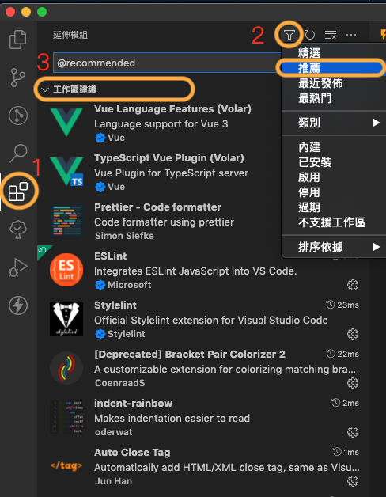

# vue3_create_Web

## 開發環境
1. 作業系統需安裝 **node** 14.18+ 、 16+ (LTS：長期支援版)
2. 確保 npm registry 指向公司 Artifactory，可透過以下指令完成
    ```bash
    npm config set strict-ssl false
    npm config set registry http://10.42.70.218/artifactory/api/npm/npm/
    npm config set @fubonlife:registry http://10.42.70.218/artifactory/api/npm/npm-local/
    npm login --scope=@fubonlife --registry=http://10.42.70.218/artifactory/api/npm/npm-local/
    ```
3. IDE: 建議使用 Visual Studio Code

<!-- ##  初始設定調整
本專案能搭配後端 OpenAPI 自動生成之 Client SDK 使用，使用前請確認是否已經發布一個個版本的 TypeScript Client SDK。
於 `package.json` 檔案上調整套件名稱及版本：
```json
// ...略...
"dependencies"： {
    // ...略...
    "@fubonlife/<%= code %>-api-axios-sdk": "1.0.0-BETA",
    // ...略...
},
// ...略...
```
> 若尚未有SDK，請搜尋『sdk』關鍵字，將所有相關程式碼註解(包含所有TypeScript程式) -->

## 安裝專案所需套件
> 請先檢查 內網是否連線
> 請先檢查 是否有 [jForg](http://10.42.70.218/ui/packages) 權限，(新進同仁 請確認是否已開通測試區帳號)
```bash
# 在專案目錄下執行
$ npm install
```

## 安裝vscode所需延伸模組
1. vscode > 檢視 > 延伸模組 (快捷鍵：`Ctrl + Shift + X` )
2. 點選上方 『篩選』按鈕 > 『推薦』
3. 安裝所有『 工作區推薦 』模組



#### 延伸模組詳細
<table border>
  <thead>
    <tr>
      <th>名稱</th>
      <th>延伸模組識別碼</th>
      <th>說明、備註</th>
    </tr>
  </thead>
  <tbody>
    <tr>
      <td>Vue Language Features(Volar)</td>
      <td><a href="https://marketplace.visualstudio.com/items?itemName=Vue.volar" target="_blank">Vue.volar</a></td>
      <td>vue3 使用 Volar，vue2 使用 Vetur，需將 Vetur延伸模組 改為 disable</td>
    </tr>
    <tr>
      <td>TypeScript Vue Plugin (Volar)</td>
      <td><a href="https://marketplace.visualstudio.com/items?itemName=Vue.vscode-typescript-vue-plugin" target="_blank">Vue.vscode-typescript-vue-plugin</a></td>
      <td>針對Vue中的 TypeScript 支援</td>
    </tr>
    <tr>
      <td>Prettier - Code formatter</td>
      <td><a href="https://marketplace.visualstudio.com/items?itemName=SimonSiefke.prettier-vscode" target="_blank">SimonSiefke.prettier-vscode</a></td>
      <td>VSCode Prettier 擴展</td>
    </tr>
    <tr>
      <td>ESLint</td>
      <td><a href="https://marketplace.visualstudio.com/items?itemName=dbaeumer.vscode-eslint" target="_blank">dbaeumer.vscode-eslint</a></td>
      <td>VSCode ESLint 擴展</td>
    </tr>
    <tr>
      <td>indent-rainbow</td>
      <td><a href="https://marketplace.visualstudio.com/items?itemName=oderwat.indent-rainbow" target="_blank">oderwat.indent-rainbow</a></td>
      <td>為每個段落顯示不同顏色的縮進</td>
    </tr>
    <tr>
      <td>Auto Close Tag</td>
      <td><a href="https://marketplace.visualstudio.com/items?itemName=formulahendry.auto-close-tag" target="_blank">formulahendry.auto-close-tag</a></td>
      <td>自動增加尾標籤</td>
    </tr>
    <tr>
      <td>Auto Rename Tag</td>
      <td><a href="https://marketplace.visualstudio.com/items?itemName=formulahendry.auto-rename-tag" target="_blank">formulahendry.auto-rename-tag</a></td>
      <td>自動重命名標籤</td>
    </tr>
    <tr>
      <td>GitLens — Git supercharged</td>
      <td><a href="https://marketplace.visualstudio.com/items?itemName=eamodio.gitlens" target="_blank">eamodio.gitlens</a></td>
      <td>探索Git存儲庫，快速了解更改行與代碼塊人員及修改時間</td>
    </tr>
    <tr>
      <td>NPM-Scripts</td>
      <td><a href="https://marketplace.visualstudio.com/items?itemName=traBpUkciP.vscode-npm-scripts" target="_blank">traBpUkciP.vscode-npm-scripts</a></td>
      <td>提供 NPM 腳本介面</td>
    </tr>
    <tr>
      <td>Svg Preview</td>
      <td><a href="https://marketplace.visualstudio.com/items?itemName=SimonSiefke.svg-preview" target="_blank">SimonSiefke.svg-preview</a></td>
      <td>可即時編輯 與 預覽 SVG</td>
    </tr>
    <tr>
      <td>TODO Highlight</td>
      <td><a href="https://marketplace.visualstudio.com/items?itemName=wayou.vscode-todo-highlight" target="_blank">wayou.vscode-todo-highlight</a></td>
      <td>TODO標籤 Highlight設定</td>
    </tr>
    <tr>
      <td>Todo Tree</td>
      <td><a href="https://marketplace.visualstudio.com/items?itemName=Gruntfuggly.todo-tree" target="_blank">Gruntfuggly.todo-tree</a></td>
      <td>快速查找所有TODO等評論標籤</td>
    </tr>
    <tr>
      <td>YAML</td>
      <td><a href="https://marketplace.visualstudio.com/items?itemName=Gruntfuggly.todo-tree" target="_blank">redhat.vscode-yaml</a></td>
      <td>針對YAML語法支持</td>
    </tr>
    <tr>
      <td>Import Cost</td>
      <td><a href="https://marketplace.visualstudio.com/items?itemName=wix.vscode-import-cost" target="_blank">wix.vscode-import-cost</a></td>
      <td>可顯示 import 套件容量大小</td>
    </tr>
    <tr>
      <td>Vue VSCode Snippets</td>
      <td><a href="https://marketplace.visualstudio.com/items?itemName=sdras.vue-vscode-snippets" target="_blank">sdras.vue-vscode-snippets</a></td>
      <td>VSCode Vue 快速生成</td>
    </tr>
  </tbody>
</table>

  

> 安裝完畢須重啟IDE，使 TypeScript 及 Eslint 設定能正常運行

## Local Run
```bash
# 在專案目錄下執行
$ npm run dev
```
> 接著瀏覽至 `http://localhost:8200/` (注意 Port 號可能不同，以 console 輸出顯示的為準) 即可看到網站。當原始碼有異動時，網站會自動 Hot Reload。

<!-- ## 各環境設定
DEV, UAT, PROD 等各環境的 Runtime 設定 (例如 API Base URL)，可在 `.env`、`.env.local`、`.env.development`、`.env.uat` 系列檔案設定，須在打包以前就先設定好。

## 打包

1. 純粹打包為靜態網站目錄，請使用以下指令
    ```bash
    # 在專案目錄下執行
    $ npm run build:dev
    ```

2. 直接打包為 WAR 檔 (部署在 JBOSS EAP, WAS)，請使用以下指令
    ```bash
    # 在專案目錄下執行
    $ mvn package -Pdev

    # 亦可透過 profile 指定編譯為其他環境:
    # mvn package -Pstaging
    # mvn package -Puat
    # mvn package -Pprod
    ```

    > 預設會使用 ArtifactId (`<%= code %>-web`) 作為 context root，可以透過指令參數改為客製化的 context root: `mvn package -Pdev -DcontextRoot=my-context-root`
## JBoss EAP Domain Mode 建議部署設定

1. `host.xml` 的 **jvms** 區塊，確認 Memory 加到適當的大小:

    ```xml
    <jvms>
        <jvm name="default">
            <heap size="64m" max-size="1024m"/>
            <jvm-options>
                <option value="-server"/>
                <option value="-XX:MetaspaceSize=96m"/>
                <option value="-XX:MaxMetaspaceSize=1024m"/>
                <option value="--add-exports=java.base/sun.nio.ch=ALL-UNNAMED"/>
            </jvm-options>
        </jvm>
    </jvms>

    ```


2. `domain.xml` 加入 Server Group:
    * 調整適當的 `port-offset`
    * 調整 `initial-host` 指向 Domain 的 JGroups Peer Discovery 位置

    ```xml
    <server-groups>
        <server-group name="<%= code %>-web" profile="full-ha">
            <jvm name="default" env-classpath-ignored="false">
            </jvm>
            <socket-binding-group ref="full-ha-sockets" port-offset="21"/>
            <deployments>
            </deployments>
            <system-properties>
                <property name="initial_hosts" value="10.240.70.43[7600]"/>
            </system-properties>
        </server-group>
    </server-groups>
    ```


3. `host.xml`  的 **servers** 區塊，加入一至數台的 Servers，作爲 Server Group 的成員。
    * `group` 就是剛剛建立 Server Group Name
    * `custom.jboss.server.log.dir` 指向外部 Log 資料夾 (通常要在 LV 內)
    * 調整適當的 `port-offset`

    ```xml
    <servers>
        <server name="<%= code %>-web-dx287" group="<%= code %>-web" auto-start="true">
            <paths>
                <path name="custom.jboss.server.log.dir" path="/jbossLog/server/<%= code %>-web-dx287"/>
            </paths>
            <jvm name="default" debug-enabled="false" env-classpath-ignored="false"/>
            <socket-bindings socket-binding-group="full-ha-sockets" port-offset="21"/>
        </server>
    </servers>
    ```


## 其他

1. 本專案初始架構是透過 [Vite](https://vitejs.dev/) 3.1.8 生成。
2. 可透過 `vue --help` 來獲得更多幫助。
``` -->
